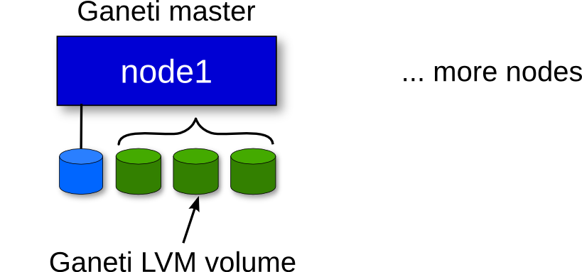

!SLIDE center transition=fade

# Cluster creation #

!SLIDE commandline transition=fade incremental

# Cluster creation #

    $ gnt-cluster init \
          --master-netdev=br42 \
          -g ganeti -s 10.1.11.200 \
          --enabled-hypervisors=kvm \
          -N link=br113 \
          -B vcpus=2,memory=512M \
          -H kvm:kernel_path=/boot/guest/vmlinuz-x86_64 \
          ganeti-cluster.osuosl.org

!SLIDE commandline center transition=fade incremental

# Adding nodes #

    $ gnt-node add \
        -s 10.1.11.201 node2
