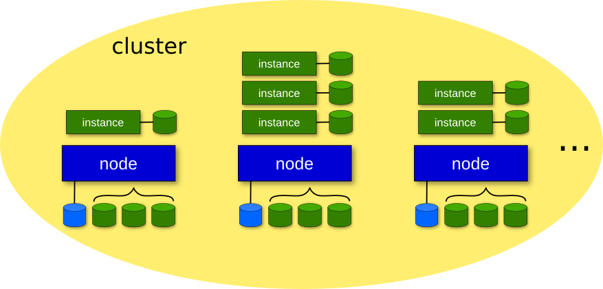

!SLIDE bullets transition=fade

# What is ganeti? #

* Software to manage a cluster of virtual servers
* Project created and maintained by Google
* Combines virtualization & data replication
* Works with multiple hypervisors
* Automates storage management
* Automates OS deployment

!SLIDES bullets smaller-img-height img-right transition=fade

# Ganeti software requirements #

* Python
* various python modules 
* DRBD
* LVM
* KVM, Xen, or LXC*

!SLIDE smbullets smaller-img-height center transition=fade

# Ganeti terminology #

* Cluster - group of nodes
* Node - physical host
* Instance - virtual machine, aka guest

