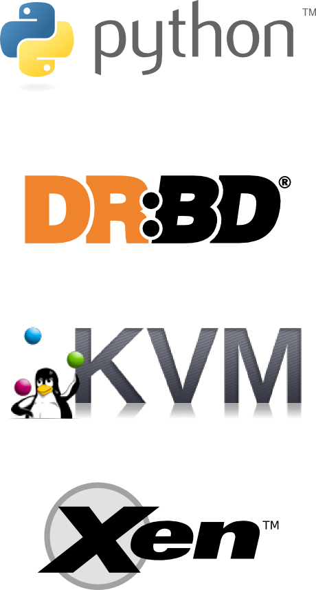

!SLIDE bullets transition=fade

# What is ganeti? #

* Software to manage a cluster of virtual servers
* Combines virtualization & data replication
* Automates storage management
* Automates OS deployment
* Project created and maintained by Google

!SLIDES bullets smaller-img-height img-right transition=fade

# Ganeti software requirements #

* Python
* various python modules 
* DRBD
* LVM
* KVM and/or Xen

!SLIDE bullets smaller-img center transition=fade

# Ganeti terminology #

* Node - physical host
* Instance - virtual machine, aka guest
* Cluster - group of nodes

