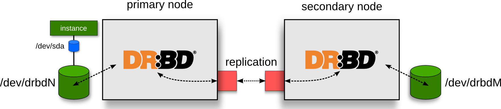

!SLIDE smbullets center transition=fade

# Storage replication: DRBD #

* Primary & secondary storage nodes
* Each instance disk synced separately
* Dedicated backend DRBD network
* Allows instance failover & migration
