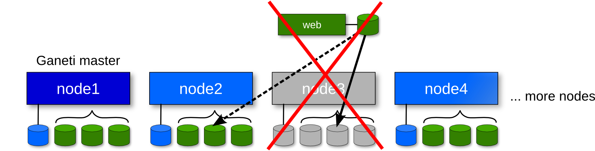
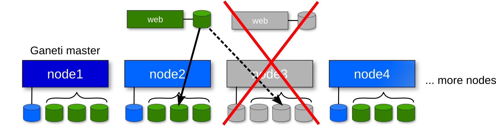
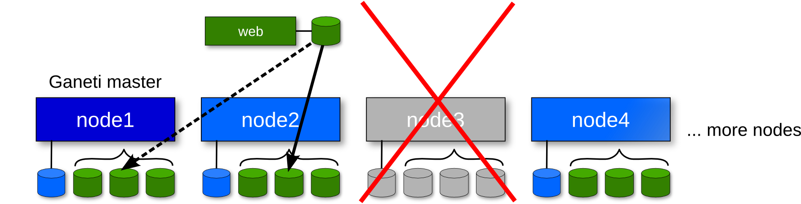

!SLIDE center transition=scrollLeft

# Primary node failure #

!SLIDE center transition=scrollLeft

# Primary node failure #

    $ gnt-instance failover --ignore-consistency gimager

!SLIDE center transition=scrollLeft

# Secondary node failure #

    $ gnt-instance replace-disks --on-secondary \
    $   --new-secondary=node1 gimager

