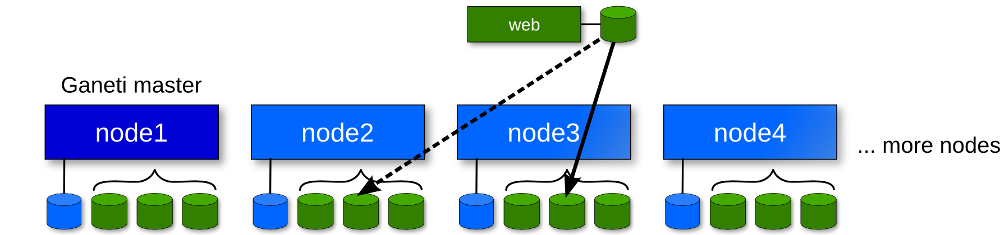

!SLIDE commandline center incremental small transition=fade

# Creating an instance #

    $ gnt-instance add -t drbd -n node3:node2 \
    $    -s 10G -o image+gentoo-hardened-cf \
    $    --net 0:link=br42  web.example.org
    * creating instance disks...
    adding instance web.example.org to cluster config
     - INFO: Waiting for instance web.example.org to sync disks.
     - INFO: - device disk/0:  3.90% done, 205 estimated seconds remaining
     - INFO: - device disk/0: 29.40% done, 101 estimated seconds remaining
     - INFO: - device disk/0: 54.90% done, 102 estimated seconds remaining
     - INFO: - device disk/0: 80.40% done, 41 estimated seconds remaining
     - INFO: - device disk/0: 98.40% done, 3 estimated seconds remaining
     - INFO: - device disk/0: 100.00% done, 0 estimated seconds remaining
     - INFO: Instance web.example.org's disks are in sync.
    * running the instance OS create scripts...
    * starting instance...

!SLIDE commandline small transition=fade

# List all instances #

    $ gnt-instance list
    Instance      OS                 Primary_node  Status  Memory
    monkeyhttpd   image+ubuntu-lucid g2.osuosl     running 512M
    mozdev-stats  image+manual       g3.osuosl     running 512M
    mulgara       image+manual       g4.osuosl     running 512M
    musicbrainzvm image+manual       g2.osuosl     running 512M
    myrtle        image+manual       g1.osuosl     running 512M
    olpc          image+manual       g3.osuosl     running 512M
    openberry     image+manual       g1.osuosl     running 512M
    openclipfont  image+manual       g4.osuosl     running 512M
    openht        image+manual       g4.osuosl     running 512M
    openmrs       image+manual       g1.osuosl     running 512M
    openvoting    image+manual       g2.osuosl     running 512M
    osi           image+manual       g4.osuosl     running 256M
    parrotvm      image+manual       g1.osuosl     running 512M
    pcc           image+manual       g1.osuosl     running 512M
    pdxplumbers   image+manual       g2.osuosl     running 512M
    polk          image+manual       g4.osuosl     running 512M
    puffin        image+manual       g3.osuosl     running 256M

!SLIDE commandline transition=fade

# Other instance commands #

    $ gnt-instance console web

    $ gnt-instance migrate web

    $ gnt-instance failover web

    $ gnt-instance reinstall -o image+ubuntu-lucid web

    $ gnt-instance info web

    $ gnt-instance list
