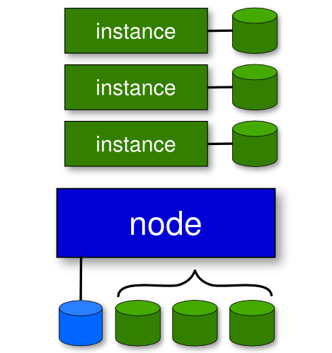

!SLIDE bullets transition=fade

# What I will cover #

* Ganeti terminology, comparisons, & goals
* Cluster & virtual machine setup
* Failure examples walk-through
* OSUOSL usage of ganeti
* Future roadmap

!SLIDE bullets transition=fade

# What is ganeti? #

* Software to manage clusters of virtual servers
* Combines virtualization & data replication
* Disk creation management
* Automated OS deployment

!SLIDE bullets center transition=fade

# Ganeti terminology #

* Node - physical host
* Instance - virtual machine

!SLIDES smbullets transition=fade

# Ganeti technology #

## DRBD ##
* Distributed Replication Block Device
* (http://www.drbd.org)

## LVM (Logical Volume Manager) ##
* Used to manage instances' volumes

## Hypervisors ##
* KVM
* Xen
