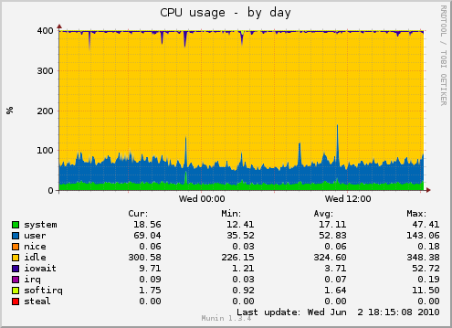
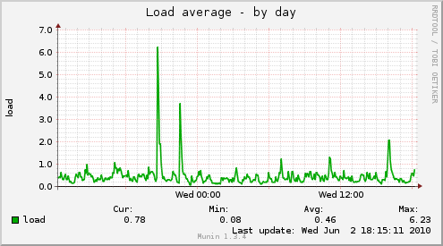
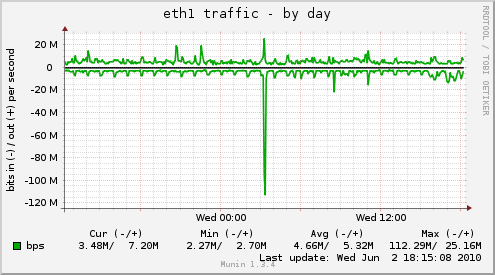

!SLIDE smbullets transition=fade

# Ganeti usage at OSUOSL #

* 4-node production cluster
* Several project clusters (OSGeo, ORVSD, OSDV, phpBB, etc)
* ~64 virtual instances
* qemu-kvm 0.11
* 64bit Gentoo Linux

## Node details ##

* DL360 G4
* 24G RAM
* 630G - RAID5 6x146G 10K SCSI HDDs

!SLIDE center transition=fade

# iSCSI vs. DRBD #

!SLIDE center transition=fade

# Ganeti node CPU #

!SLIDE center transition=fade

# Ganeti node LOAD #

!SLIDE center transition=fade

# Ganeti node DRBD #

!SLIDE bullets transition=fade

# OSUOSL future ganeti plans #

* KSM (Kernel SamePage Merging)
* Upgrade to qemu-kvm 0.12
* Migrate hosts from libvirt
* Puppet integration
* Web-based tools
* libcloud
